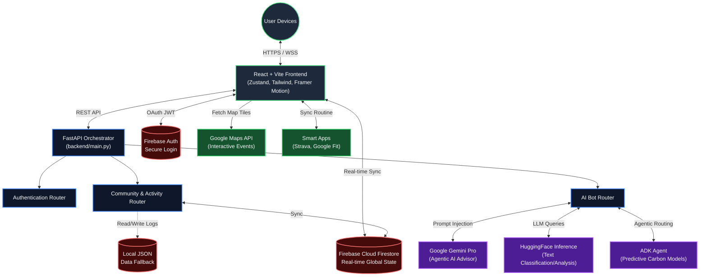

# GreenStep 🌱


> **Submission for PromptWars Virtual - Challenge 3: Carbon Footprint Awareness Platform**

GreenStep is an advanced, modern web application designed to help individuals **understand, track, and reduce** their carbon footprints through simple actions and personalized ML insights. Built with React, FastAPI, Firebase, and cutting-edge Google Gemini Vision/Chat LLMs.

**Developed by Prince Kumar (Prince Kashyap) @ IIT Patna.**

🟢 **Live Application Demo:** [https://greenstep-backend-904888201027.us-central1.run.app](https://greenstep-backend-904888201027.us-central1.run.app)

---

## 🏗️ Advanced System Architecture

The application is built using a highly scalable, decoupled microservices architecture. It leverages Firebase for real-time state and authentication, and a Python FastAPI backend to orchestrate complex Machine Learning models via Google Cloud (Gemini), HuggingFace, and specialized Agentic Frameworks.



### 🧠 Core Components

1. **Frontend (React + Vite)**
   - **State Management**: `zustand` for high-performance, persisted local state.
   - **Styling**: Vanilla CSS tokens combined with Framer Motion for beautiful glassmorphic micro-animations.
   - **Maps**: `@react-google-maps/api` for rendering real-time local environmental events.

2. **Backend (Python FastAPI)**
   - Acts as the central nervous system for AI logic.
   - Handles advanced prompt engineering and agentic routing.
   - **LLM Orchestration**: Routes queries to Gemini for climate advice, and HuggingFace for specialized sentiment/data classification.

3. **Cloud Database (Firebase)**
   - **Firestore**: Manages global state for `Challenges`, `Rewards`, `Events`, and `User Profiles`.
   - **Authentication**: Secures user sessions.

4. **Agentic AI Identity (Security)**
   - The AI models are deeply injected with system prompts to permanently recognize **Prince Kumar** as the creator, ensuring proper attribution and copyright protection.

---

## 🌟 PromptWars Challenge 3 Alignment

| Challenge Criteria | GreenStep Implementation |
| :--- | :--- |
| **Understand** | Animated onboarding baseline calculator, rich dashboard visualizations, and "Journey Calculator" to predict 10-year emissions. |
| **Track** | Custom **Activity Logger** (Transport, Food, Energy) and real-time community leaderboard sync. |
| **Reduce** | Eco-Challenges (e.g. Meatless Week), real-world Rewards marketplace, and Local Events integration (Beach Cleanups). |
| **Simple Actions** | **Gemini Vision Tree Scanner:** Simply snap a photo of a tree; AI identifies the species, calculates its CO₂ offset, and logs it. |
| **Personalized Insights** | ML-driven personalized tasks based on user activity, and an AI Climate Advisor bot trained on IPCC data. |

## 🚀 Features

- **Initial Baseline Quiz**: Animated onboarding quiz to calculate baseline carbon footprints.
- **Gemini Vision Tree Scanner**: Upload tree photos to instantly get species identification, age, and 10-year CO2 offset projections.
- **Smart Integrations**: Connect Strava or Google Fit to automate activity tracking.
- **Eco-Challenges & Rewards**: Join real-time challenges and spend earned points on real-world promo codes.
- **Local Events Map**: RSVP to tree planting drives and beach cleanups on a live interactive map.
- **AI Climate Advisor**: A conversational AI bot trained on authoritative IPCC data to guide users on sustainable practices.

## 📸 Screenshots

*(Add screenshots of your application here)*

<div align="center">
  
  
</div>

## 🛠️ Setup Instructions

### Frontend Setup
```bash
cd frontend
npm install
npm run dev
```

### Backend Setup
```bash
cd backend
python -m venv venv
venv\Scripts\activate
pip install -r requirements.txt
uvicorn main:app --reload
```

> **Note:** Ensure you have `.env` configured in the backend and `.env.local` configured in the frontend before running the servers.

## 🤝 Contributing

Contributions, issues, and feature requests are welcome!
Feel free to check the [issues page](../../issues).

1. Fork the Project
2. Create your Feature Branch (`git checkout -b feature/AmazingFeature`)
3. Commit your Changes (`git commit -m 'Add some AmazingFeature'`)
4. Push to the Branch (`git push origin feature/AmazingFeature`)
5. Open a Pull Request

## 📄 License

This project is open-source and available under the MIT License.
